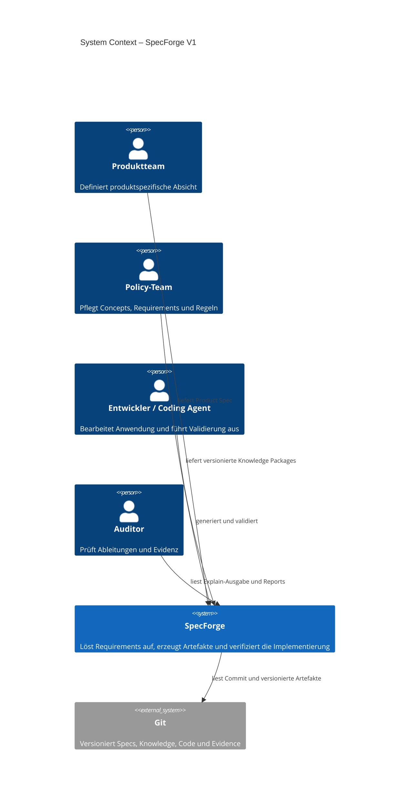
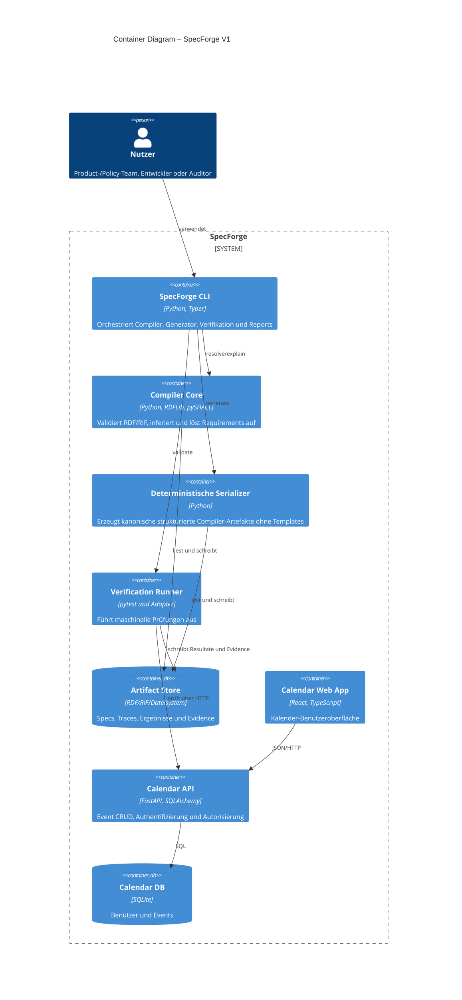
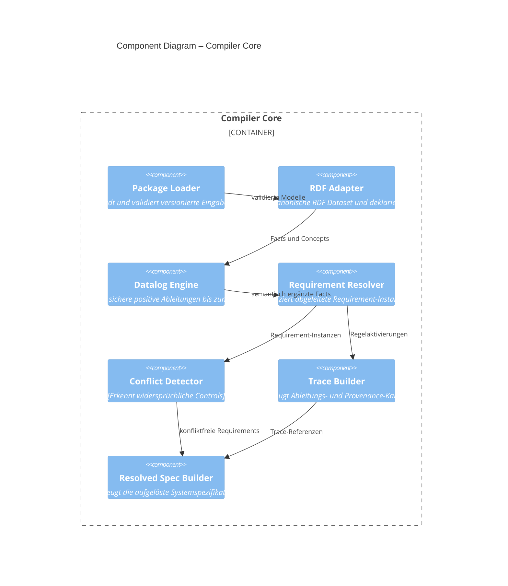

# SpecForge – Architekturdokumentation nach arc42

Status: Entwurf für Version 1

## 1. Einführung und Ziele

SpecForge ist ein deterministischer Requirements & Compliance Compiler. Er verbindet eine produktspezifische Spezifikation mit versioniertem semantischem Wissen, zentralen Regeln und technischen Implementierungsmustern. Sein Ergebnis ist eine aufgelöste Systemspezifikation, aus der Anwendungsteile und Tests erzeugt sowie nachvollziehbare Evidenz abgeleitet werden.

Die wichtigsten Qualitätsziele sind:

| Priorität | Qualitätsziel | Nachweis in V1 |
|---|---|---|
| 1 | Determinismus | Gleiche versionierte Eingaben erzeugen byte-identische kanonische Compiler-Artefakte. |
| 2 | Erklärbarkeit | Jedes Derived Requirement besitzt einen vollständigen Ableitungspfad. |
| 3 | Maschinenentscheidbarkeit | Jede Requirement-Definition besitzt eine ausführbare Verifikation; mehrdeutige Definitionen werden abgelehnt. |
| 4 | Reproduzierbarkeit | Evidence referenziert Git-Commit, Eingabe-Hashes, Toolversionen und Testresultate. |
| 5 | Änderbarkeit | Product, Knowledge, Patterns und Anwendung sind klar getrennt und unabhängig versionierbar. |

Stakeholder:

- Produktteams definieren produktspezifische Entitäten, Operationen und Requirements.
- Policy-Teams pflegen Concepts, Requirements und Regeln in eigenen Namespaces.
- Plattformteams pflegen Implementierungsmuster und Verifikationsadapter.
- Entwickler und Coding Agents implementieren beziehungsweise ändern Anwendungscode.
- Auditoren untersuchen Ableitungen, Evidenz und Versionen.

## 2. Randbedingungen

- Compiler und Backend werden in Python implementiert.
- Die Kalenderanwendung verwendet FastAPI, SQLite, React und TypeScript.
- V1 läuft vollständig lokal und wird über Docker Compose startbar sein.
- TriG/Turtle und RIF Core sind die fachlichen Autorenformate; SHACL ist ihr
  öffentlicher Vertrag und RDFC-1.0 plus SHA-256 bestimmt den semantischen Hash.
- Der deterministische Entscheidungspfad enthält kein LLM.
- V1 verwendet keine Graphdatenbank; RDFLib und pySHACL laufen vollständig im Prozess.
- Alle Requirements müssen maschinell entscheidbar sein. Eine unzureichende Definition ist ein Compile-/Package-Fehler.
- Zentrale Knowledge Packages werden vom Produkt referenziert, nicht in dessen Spec kopiert.

## 3. Kontextabgrenzung

### 3.1 Fachlicher Kontext – C4 Level 1



### 3.2 Technischer Kontext

Eingaben:

- Product Spec,
- Concept-, Requirement-, Rule- und Pattern-Packages,
- agentisch verwalteter Anwendungscode,
- Anwendungsquellcode,
- Git-Metadaten.

Ausgaben:

- normalisierte Facts,
- semantische Facts,
- Resolved System Specification,
- Traceability Graph,
- generierte Anwendungsteile und Tests,
- Evidence Bundle,
- Requirement Report.

## 4. Lösungsstrategie

SpecForge verwendet eine Compiler-Pipeline mit persistierbaren Zwischenartefakten. TriG/Turtle und RIF Core sind die normativen Autorenformate. Ein RDF Dataset mit stabilen IRIs und Named Graphs ist die kanonische Intermediate Representation; Pydantic-Modelle und JSON sind ausschließlich interne beziehungsweise kompatible Projektionen. Sichere positive Datalog-Regeln erzeugen am kleinsten Fixpunkt Requirement-Instanzen. SHACL validiert Autorenquellen und das aufgelöste Metamodell, PROV-O beschreibt die Herkunft.

Mehrdeutigkeit wird nicht als Laufzeitstatus modelliert: Jede Requirement-Definition muss mindestens eine ausführbare Verification Specification besitzen. Kann sie nicht eindeutig geprüft werden, schlägt die Package-Validierung fehl.

## 5. Bausteinsicht

### 5.1 Container – C4 Level 2



### 5.2 Compiler-Komponenten – C4 Level 3



Verantwortungsregel: Der Resolver entscheidet, welche Requirements gelten. Der Verification Runner entscheidet anhand spezifizierter Beobachtungen, ob diese Requirements erfüllt sind. Der Generator trifft keine Policy-Entscheidungen.

## 6. Laufzeitsicht

### 6.1 Resolve

```text
CLI → Package Loader → RDF Adapter → Datalog Engine
    → Requirement Resolver → Conflict Detector
    → SHACL → PROV Trace → RDF-/Kompatibilitätsausgaben
```

Bei ungültigem Schema, undefiniertem Begriff, nicht ausführbarer Requirement-Verifikation oder Regelkonflikt endet der Lauf ohne Resolved Spec.

### 6.2 Validate

```text
CLI → Resolved Spec laden → Verification Plan erstellen
    → Anwendung/Testadapter ausführen → Beobachtungen normalisieren
    → Expected gegen Observed vergleichen → Evidence schreiben
    → Report erzeugen
```

Ein Requirement erhält `VERIFIED` nur, wenn alle ihm zugeordneten obligatorischen Verifikationen für denselben Softwarestand bestanden wurden.

### 6.3 Explain

`explain` traversiert den gespeicherten Trace rückwärts von Requirement-Instanzen über Regelaktivierungen und Facts bis zu versionierten Quellen. Die Requirement-Definition wird einmal dargestellt; darunter erscheinen typisierte Targets und target-spezifische Verification-Instanzen. Target-Filter und Gruppierungen nach Target-Typ, Regel, Resource oder beliebigen Fact-Prädikaten sind reine Projektionen und verändern weder Trace noch fachliche Entscheidungen.

## 7. Verteilungssicht

V1 läuft lokal:

```text
Docker Compose
├── calendar-web
└── calendar-api
    └── SQLite Volume

Host/CI
└── specforge CLI + pytest
```

Der Compiler benötigt zur Laufzeit der Anwendung keinen eigenen Dienst. Generierung und Verifikation sind Build-/Entwicklungsaktivitäten.

## 8. Querschnittliche Konzepte

### Determinismus

- stabile Sortierung aller Collections,
- kanonische JSON-Serialisierung,
- keine Zeitstempel in Compiler-Artefakten,
- Zeitstempel nur in Evidence-Läufen,
- Content-Hashes für alle Eingabepakete.

### Provenance und Traceability

Jedes abgeleitete Objekt referenziert seine Quellen, Regelversion und gebundenen Variablen. Eine Verification-Definition wird für jedes typisierte Target als eigene Verification-Instanz materialisiert, beispielsweise `TEST-SEC-001@operation:read_event`. Evidence referenziert diese Verification-Instanz, die zugehörige Requirement-Instanz und einen Git-Commit.

### Maschinenentscheidbarkeit

Requirement-Definitionen deklarieren eine formale Erwartung und mindestens einen Verification Adapter. Adjektive wie „angemessen“, „ausreichend“ oder „Stand der Technik“ sind ohne messbaren Grenzwert oder versionierte Referenz unzulässig. Der Knowledge-Linter meldet solche Definitionen als nicht veröffentlichbar.

### Ownership und Versionierung

Knowledge-Pakete besitzen Namespace, Owner, semantische Version und Content-Hash. Product Specs pinnen exakte Paketversionen über ein Lockfile.

### Sicherheit

Die Demo-Authentifizierung ist ausdrücklich nicht produktionsreif. Autorisierung wird serverseitig und möglichst in der Datenabfrage erzwungen. Geheimnisse gehören nicht in Specs oder Evidence.

## 9. Architekturentscheidungen

- TriG/Turtle, SHACL und RIF Core statt einer proprietären YAML-Autorensprache; OWL bleibt ohne aktives Conformance-Profil.
- Eigene beschränkte Regel-DSL statt universeller Rule Engine.
- In-Memory-Graph und JSON statt Graphdatenbank.
- Hybrid-Generierung statt Überschreiben handgeschriebener Fachlogik.
- Vollständige Revalidierung statt inkrementeller Ausführung.
- Unentscheidbare Definitionen sind Fehler, kein Review-Status.

Diese Entscheidungen werden bei der Implementierung als einzelne ADRs dokumentiert.

## 10. Qualitätsanforderungen

- Zwei Läufe mit identischen Eingaben erzeugen identische Resolved Specs und Traces.
- Jede Derived Requirement-Instanz ist über `explain` bis zu ihren Quellen nachvollziehbar.
- Jede Requirement-Definition ohne ausführbare Verifikation wird abgelehnt.
- Ein anonymer Zugriff auf Event-Daten erzeugt HTTP 401.
- Ein Benutzer erhält keine Events eines anderen Benutzers.
- Evidence ohne Commit, Input-Hashes oder Testresultat wird abgelehnt.
- Eine rein visuelle Frontend-Änderung verändert die Resolved Spec nicht.

## 11. Risiken und technische Schulden

- Die eigene DSL muss klein bleiben und benötigt strenge Kompatibilitätsregeln.
- Tests liefern konkrete Evidenz, aber keinen universellen mathematischen Beweis.
- Das Mapping zwischen Code und Controls kann driften und benötigt später zusätzliche statische Prüfer.
- Ein ausschließlich maschinenentscheidbares Modell erfordert präzise, teilweise engere Policy-Definitionen. Nicht formalisierte Rechtsaussagen liegen außerhalb des Systemumfangs und dürfen nicht im Report erscheinen.
- Vollständige Neuberechnung ist für V1 akzeptabel, skaliert aber nicht unbegrenzt.

## 12. Glossar

| Begriff | Bedeutung |
|---|---|
| Declared Requirement | Vom Produkt explizit angegebene Anforderung. |
| Derived Requirement | Durch eine versionierte Regel erzeugte Requirement-Instanz. |
| Fact | Typisierte Aussage aus Spec, Semantik oder Beobachtung. |
| Concept | Semantischer Begriff mit Beziehungen und Klassifikationen. |
| Resolved Spec | Vollständige, konfliktfreie Menge der für ein Produkt geltenden Aussagen und Controls. |
| Verification | Maschinell ausführbare Prüfung einer formalen Erwartung. |
| Evidence | Versionierte Beobachtung und Ergebnis einer Verification. |
| Trace | Gerichteter Ableitungspfad von Quellen zu Requirements und Evidence. |
